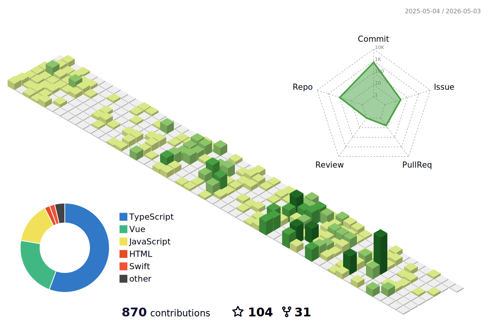

 
### Hey 🤔! I'm fxzer.🌐 

 
  <h2 > 👨🏻‍💻 关于我 </h2>

- 🔭 &nbsp; 一名会点Vue、React的前端开发
- 🤔 &nbsp; 没事喜欢逛开源社区学习优秀代码
- 🎓 &nbsp; 喜欢探索新技术和折腾有意思的项目
- 🌱 &nbsp; 爱好动漫和偶尔去健身房溜达溜达

 
 
<h2>🛠 技术栈</h2>

<table >
  <tbody>
    <tr valign="top">
      <td width="25%" align="center">
        𝗛𝗧𝗠𝗟𝟱   
        
      </td>
      <td width="25%" align="center">
        𝗖𝗦𝗦𝟯   
        
      </td>
      <td width="25%" align="center">
        𝗝𝗮𝘃𝗮𝗦𝗰𝗿𝗶𝗽𝘁   
        
      </td>
      <td width="25%" align="center">
        𝗩𝘂𝗲   
        
      </td>
    </tr>
    <tr valign="top">
      <td width="25%" align="center">
        𝗪𝗲𝗯𝗽𝗮𝗰𝗸   
        
      </td>
      <td width="25%" align="center">
        𝗘𝘀𝗹𝗶𝗻𝘁   
        
      </td>
      <td width="25%" align="center">
        𝗚𝗶𝘁   
        
      </td>
      <td width="25%" align="center">
        𝗩𝗦 𝗖𝗼𝗱𝗲   
        
      </td>
    </tr>
  
  </tbody>
</table>
 
<h2>💻  统计数据 </h2>

<picture>
  <source media="(prefers-color-scheme: dark)" srcset="github-snake-dark.svg" />
  <source media="(prefers-color-scheme: light)" srcset="github-snake.svg" />
  
</picture>