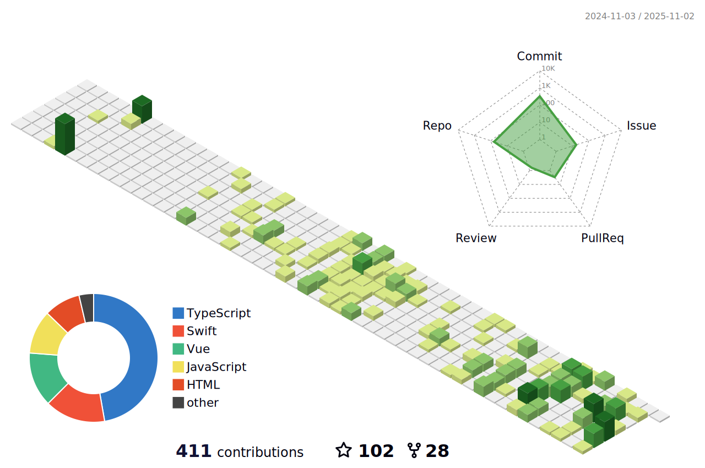

 
<svg xmlns="http://www.w3.org/2000/svg" xmlns:xlink="http://www.w3.org/1999/xlink" style="z-index:1;position:relative" width="854" height="200" viewBox="0 0 854 200">
    
    <g transform="translate(427, 100) scale(1, 1) translate(-427, -100)">

                    <defs>
        <linearGradient id="linear" x1="0%" y1="0%" x2="100%" y2="0%">
            <stop offset="0%" stop-color="#B993D6"/><stop offset="100%" stop-color="#8CA6DB"/>
        </linearGradient>
    </defs>

                    <path d="" fill="url(#linear)" opacity="0.4" >
    <animate attributeName="d" dur="20s" repeatCount="indefinite" keyTimes="0;0.333;0.667;1" calcmod="spline" keySplines="0.2 0 0.2 1;0.2 0 0.2 1;0.2 0 0.2 1" begin="0s" values="M0 0L 0 120Q 213.5 160 427 130T 854 155L 854 0 Z;M0 0L 0 145Q 213.5 160 427 140T 854 130L 854 0 Z;M0 0L 0 165Q 213.5 135 427 165T 854 130L 854 0 Z;M0 0L 0 120Q 213.5 160 427 130T 854 155L 854 0 Z"></animate>
</path>
<path d="" fill="url(#linear)" opacity="0.4" >
    <animate attributeName="d" dur="20s" repeatCount="indefinite" keyTimes="0;0.333;0.667;1" calcmod="spline" keySplines="0.2 0 0.2 1;0.2 0 0.2 1;0.2 0 0.2 1" begin="-10s" values="M0 0L 0 135Q 213.5 180 427 150T 854 160L 854 0 Z;M0 0L 0 150Q 213.5 120 427 120T 854 140L 854 0 Z;M0 0L 0 145Q 213.5 125 427 150T 854 165L 854 0 Z;M0 0L 0 135Q 213.5 180 427 150T 854 160L 854 0 Z"></animate>
</path>
    </g>

            <text text-anchor="middle" alignment-baseline="middle" x="50%" y="30%" class="text" style="fill:#f7f5f5;" stroke="#none" stroke-width="10" > Welcome to my profile!</text>

</svg>
        

### Hey 🤔! I'm fxzer.🌐

 
  <h2 > 👨🏻‍💻 关于我 </h2>

- 🔭 &nbsp; 一名会点Vue、React的前端开发
- 🤔 &nbsp; 没事喜欢逛开源社区学习优秀代码
- 🎓 &nbsp; 喜欢探索新技术和折腾有意思的项目
- 🌱 &nbsp; 爱好动漫和偶尔去健身房溜达溜达

 
 
<h2>🛠 技术栈</h2>

<table >
  <tbody>
    <tr valign="top">
      <td width="25%" align="center">
        𝗛𝗧𝗠𝗟𝟱   
        
      </td>
      <td width="25%" align="center">
        𝗖𝗦𝗦𝟯   
        
      </td>
      <td width="25%" align="center">
        𝗝𝗮𝘃𝗮𝗦𝗰𝗿𝗶𝗽𝘁   
        
      </td>
      <td width="25%" align="center">
        𝗩𝘂𝗲   
        
      </td>
    </tr>
    <tr valign="top">
      <td width="25%" align="center">
        𝗪𝗲𝗯𝗽𝗮𝗰𝗸   
        
      </td>
      <td width="25%" align="center">
        𝗘𝘀𝗹𝗶𝗻𝘁   
        
      </td>
      <td width="25%" align="center">
        𝗚𝗶𝘁   
        
      </td>
      <td width="25%" align="center">
        𝗩𝗦 𝗖𝗼𝗱𝗲   
        
      </td>
    </tr>
  
  </tbody>
</table>
 
<h2>💻  统计数据 </h2>

